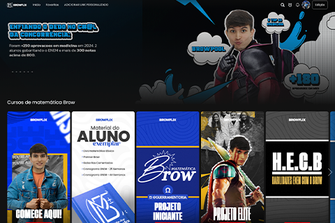

# 🔄 Cache Bust Completo Implementado

## 📅 Data: 01/11/2025 | Versão: 2024110101

---

## ✅ O QUE FOI ATUALIZADO

### 1. **Meta Tags de Controle de Cache no HTML**

Adicionadas tags para forçar o navegador a não cachear a página:

```html
<meta http-equiv="Cache-Control" content="no-cache, no-store, must-revalidate" />
<meta http-equiv="Pragma" content="no-cache" />
<meta http-equiv="Expires" content="0" />
```

**Efeito:** Navegadores sempre requisitam a versão mais recente da página.

---

### 2. **Versionamento de Recursos Estáticos**

#### CSS:
```html
<!-- ANTES -->
<link rel="stylesheet" href="assets/css/styles.css?v=2.0" />

<!-- DEPOIS -->
<link rel="stylesheet" href="assets/css/styles.css?v=2024110101" />
```

#### JavaScript:
```html
<!-- ANTES -->
<script src="assets/js/main.js?v=20241220-020"></script>

<!-- DEPOIS -->
<script src="assets/js/main.js?v=2024110101"></script>
```

---

### 3. **Cache Bust Dinâmico no Config.json**

```javascript
// Adiciona timestamp único em cada carregamento
const cacheBust = `?v=${Date.now()}`;
const configPath = `${basePath}/config/config.json${cacheBust}`;
```

**Resultado:** Config.json NUNCA usa cache, sempre carrega a versão mais recente.

---

### 4. **Cache Bust nas Imagens HTML (Banners Fixos)**

#### Banner da Didática:
```html
<!-- ANTES -->


<!-- DEPOIS -->

```

#### Banner do Fundador:
```html
<!-- ANTES -->


<!-- DEPOIS -->

```

---

### 5. **Cache Bust em TODAS as Imagens Dinâmicas (JavaScript)**

Adicionada propriedade `cacheBustVersion` na classe principal:

```javascript
class BrowflixLanding {
  constructor() {
    this.config = null;
    this.cacheBustVersion = '2024110101'; // ✅ NOVO
    this.init();
  }
}
```

#### Imagens dos Aprovados:
```javascript
// ANTES
``

// DEPOIS
``
```

#### Banners dos Cursos:
```javascript
// ANTES
``

// DEPOIS
``
```

#### Banners das Features:
```javascript
// ANTES
``

// DEPOIS
``
```

---

## 📊 RECURSOS COM CACHE BUST

| Recurso | Método | Versão |
|---------|--------|--------|
| **HTML** | Meta tags | Always reload |
| **CSS** | Query string | `v=2024110101` |
| **JavaScript** | Query string | `v=2024110101` |
| **Config.json** | Timestamp dinâmico | `v=1730505...` (único) |
| **Banner Didática** | Query string | `v=2024110101` |
| **Banner Fundador** | Query string | `v=2024110101` |
| **Imagens Aprovados** | Query string | `v=2024110101` |
| **Banners Cursos** | Query string | `v=2024110101` |
| **Banners Features** | Query string | `v=2024110101` |

---

## 🚀 COMMIT ENVIADO

```bash
Commit: 9471a64
Mensagem: Fix: Implementar cache bust completo em todo o projeto (v2024110101)
Status: ✅ Enviado para GitHub
```

```
To github.com:GabrielRaiolR/BROWFLIX-LP.git
   ae91b98..9471a64  main -> main
```

---

## ⏱️ COMO TESTAR

### 1️⃣ Aguarde 3-5 minutos
O GitHub Pages precisa reconstruir o site com as novas alterações.

### 2️⃣ Abra em Modo Anônimo
Para garantir que não há cache local:

- **Chrome/Edge:** `Ctrl + Shift + N`
- **Firefox:** `Ctrl + Shift + P`

### 3️⃣ Acesse o Site
```
https://gabrielraiolr.github.io/BROWFLIX-LP/
```

### 4️⃣ Abra o DevTools (F12)

#### Aba Console:
Procure por:
```
🔍 Tentando carregar config de: ...config/config.json?v=1730505600000
✅ Configuração carregada com sucesso
✅ Plataforma Browflix carregada com sucesso!
```

**Importante:** Note o timestamp único no config.json!

#### Aba Network:
1. Recarregue a página (F5)
2. Filtre por "Img" ou "All"
3. Verifique se todas as requisições têm `?v=2024110101`

Exemplos esperados:
```
✅ styles.css?v=2024110101
✅ main.js?v=2024110101
✅ config.json?v=1730505600000 (timestamp único)
✅ Adryel.png?v=2024110101
✅ Plataforma-home.png?v=2024110101
✅ Fundador.png?v=2024110101
```

### 5️⃣ Verifique Visualmente
- ✅ 9 fotos de aprovados aparecem
- ✅ Nomes corretos (Adryel, Arthur, Emerson, etc.)
- ✅ Banner da Didática aparece
- ✅ Banner do Fundador aparece
- ✅ Banners dos cursos aparecem

---

## 🎯 O QUE ISSO RESOLVE

### ❌ Antes:
- Navegadores mantinham cache por dias/semanas
- Mudanças no config.json não apareciam
- Imagens antigas continuavam aparecendo
- Usuários precisavam limpar cache manualmente

### ✅ Depois:
- **Config.json:** SEMPRE carrega a versão mais recente (timestamp único)
- **CSS/JS:** Cache controlado por versão (`v=2024110101`)
- **Imagens:** Cache controlado por versão (`v=2024110101`)
- **HTML:** Meta tags forçam reload

---

## 🔄 PARA PRÓXIMAS ATUALIZAÇÕES

Quando precisar forçar atualização de todos os recursos:

1. **Altere a versão** em `main.js`:
```javascript
this.cacheBustVersion = '2024110102'; // Incremente o número
```

2. **Atualize as referências** no `index.html`:
```html
<link rel="stylesheet" href="assets/css/styles.css?v=2024110102" />
<script src="assets/js/main.js?v=2024110102"></script>


```

3. **Faça commit e push:**
```bash
git add assets/js/main.js index.html
git commit -m "Update cache bust version to 2024110102"
git push origin main
```

**Nota:** O config.json não precisa de atualização manual, pois usa timestamp dinâmico!

---

## 💡 BENEFÍCIOS

1. **Atualização Instantânea:** Mudanças aparecem imediatamente (após GitHub Pages rebuild)
2. **Sem Problemas de Cache:** Cada versão tem um identificador único
3. **Melhor UX:** Usuários sempre veem a versão mais recente
4. **Fácil Manutenção:** Um único número para atualizar

---

## 📝 ESTRUTURA FINAL

```
BROWFLIX-LP/
├── index.html ✅ 
│   ├── Meta tags de cache control
│   ├── CSS?v=2024110101
│   ├── JS?v=2024110101
│   ├── Banner Didática?v=2024110101
│   └── Banner Fundador?v=2024110101
│
├── config/
│   └── config.json ✅ (timestamp dinâmico)
│
└── assets/
    ├── js/
    │   └── main.js ✅
    │       ├── cacheBustVersion = '2024110101'
    │       ├── Config.json com timestamp único
    │       ├── Imagens aprovados?v=2024110101
    │       ├── Banners cursos?v=2024110101
    │       └── Banners features?v=2024110101
    │
    ├── css/
    │   └── styles.css ✅
    │
    └── images/
        ├── banners/ ✅
        │   ├── Fundador.png
        │   ├── Plataforma-home.png
        │   └── [outros banners]
        └── APROVADOS/ ✅
            └── UFPA/ (61 imagens)
```

---

## ✅ CHECKLIST DE VERIFICAÇÃO

Após 5 minutos da atualização:

- [ ] Site abre sem erros
- [ ] Console mostra config.json com timestamp único
- [ ] Network mostra todos os recursos com `?v=2024110101`
- [ ] Imagens dos 9 aprovados aparecem
- [ ] Nomes corretos dos aprovados
- [ ] Banner da Didática aparece
- [ ] Banner do Fundador aparece
- [ ] Banners dos cursos aparecem
- [ ] Sem erros 404 no console
- [ ] Sem imagens antigas em cache

---

## 🎉 RESULTADO FINAL

**TODOS os recursos agora têm controle de cache!**

Qualquer mudança no projeto será imediatamente visível após o GitHub Pages reconstruir o site (2-5 minutos).

---

**Versão:** v2024110101  
**Status:** ✅ **IMPLEMENTADO E ENVIADO PARA GITHUB**  
**Último commit:** `9471a64`

